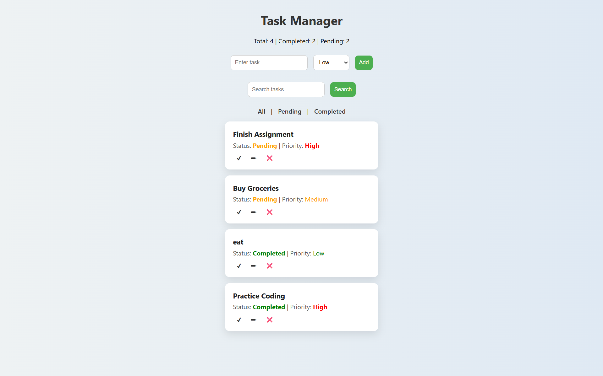
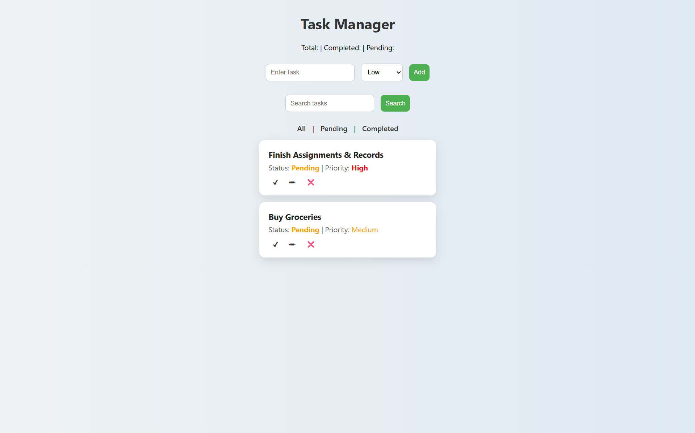
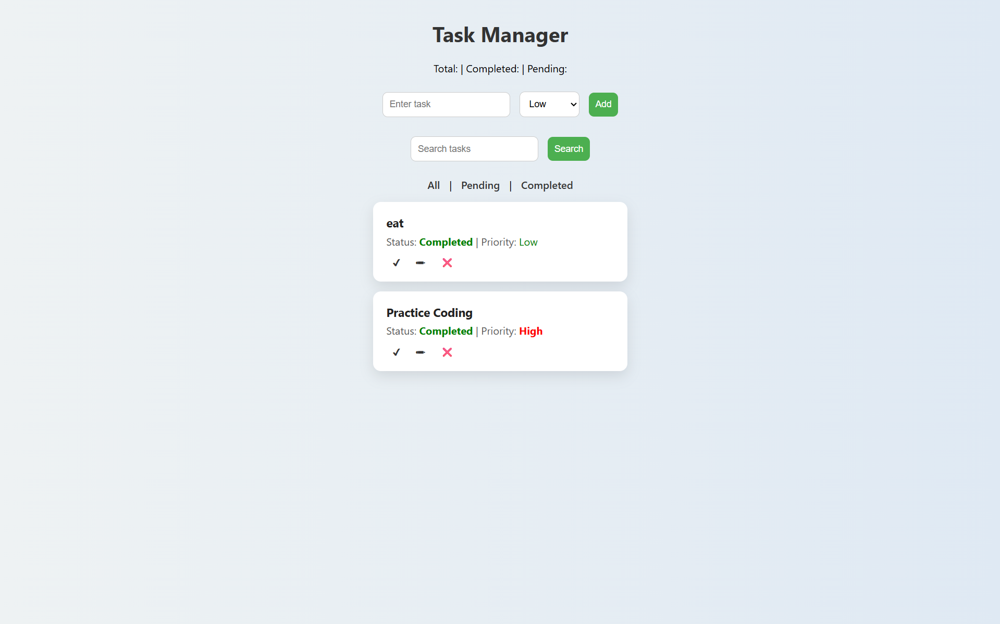
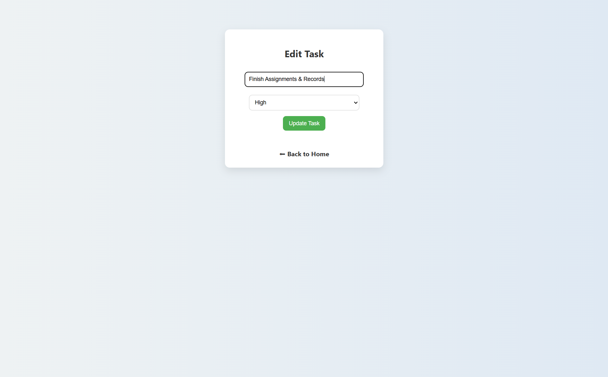
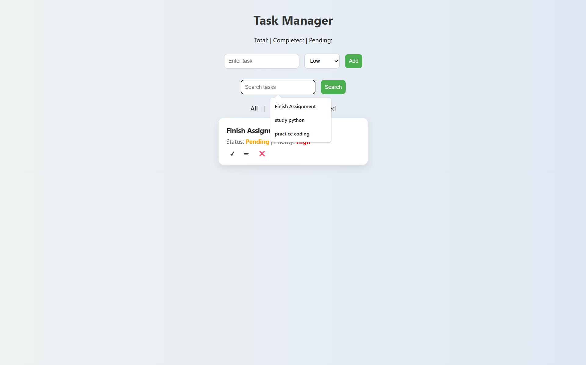

# Task Manager Web App

A full-stack task management web application built using Flask and SQLite.  
This application allows users to manage daily tasks efficiently with features like adding, editing, deleting, filtering, and searching tasks.

---

## Features

- Add new tasks with priority levels (High, Medium, Low)
- Edit existing tasks
- Delete tasks
- Mark tasks as completed
- Search tasks
- Filter tasks (All / Pending / Completed)
- Persistent storage using SQLite database

---

## Tech Stack

- Frontend: HTML, CSS  
- Backend: Python (Flask)  
- Database: SQLite  

---

## Screenshots

### Home Page


### Pending Tasks


### Completed Tasks


### Edit Task


### Search Feature


---

## Installation
```bash
git clone https://github.com/redishettysanjana/task-manager-flask.git
cd task-manager-flask
pip install flask
python app.py


**## Live Demo**
https://task-manager-flask-jpn6.onrender.com
